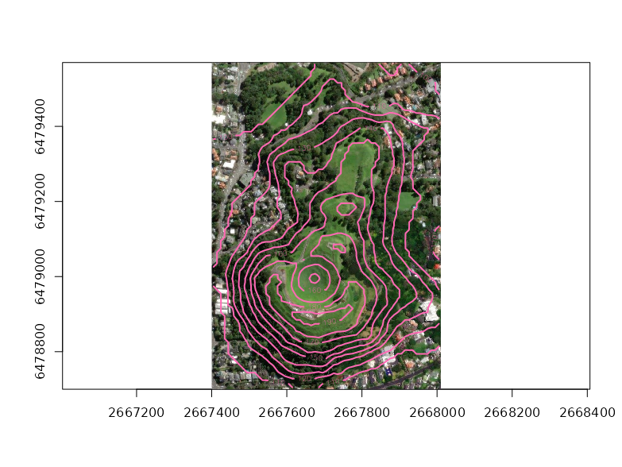

<!-- README.md is generated from README.Rmd. Please edit that file -->

# dsn

<!-- badges: start -->

[](https://github.com/hypertidy/dsn/actions/workflows/R-CMD-check.yaml)
<!-- badges: end -->

The goal of dsn is to provide simple helpers for
[GDAL](https://gdal.org/) data source name prefixes and related string
handling.

Please note that dsn is not doing anything *with GDAL*, this is pure
string handling for things commonly used for GDAL:

- prefixing `/vsicurl/` to an online data source url for [GDAL’s Virtual
  File System](https://gdal.org/user/virtual_file_systems.html)
- prefixing a driver declaration to a data source,
  e.g. `HDF5:/my/files/data.h5` or `NETCDF:C:/temp/nc/afile.nc`
- wrapping a
  [subdataset](https://gdal.org/user/raster_data_model.html#subdatasets-domain)
  declaration, e.g. `NETCDF:/myfiles/data.nc:variable` that can occur in
  [NETCDF](https://gdal.org/drivers/raster/netcdf.html#multiple-image-handling-subdatasets)
  and similar formats
- wrapping a [VRT
  connection](https://gdal.org/drivers/raster/vrt.html#vrt-connection-string),
  e.g. `vrt://myfile.tif?bands=3,2,1`
- creating a DATAPOINTER connection for the MEM driver, i.e. we can
  create data arrays as rasters from R objects, and use R objects for
  georeferencing with geolocation arrays (either rectilinear or
  curvilinear, or degenerate versions of these)
- datatype helpers for the internal GDT\_ types in GDAL
- creating GCP lists for use with VRT, for simple extent georeferencing
  or full polynomial ground control point registration

Please see the Python package
[osgeo.gdal](matrix(x%5B%5B1%5D%5D,%20attr(x,%20%22dimension%22)%5B2L%5D,%20byrow%20=%20TRUE))
or the R package
[vapour::vapour_vrt()](https://hypertidy.github.io/vapour/reference/vapour_vrt.html)
for actual use of GDAL to extend a data source name by opening the
source and augmenting available information. dsn is intended to support
that usage, and in general intends to be purely string handling, and not
make use of the format libraries at all.

## Installation

You can install the development version of dsn from
[GitHub](https://github.com/) with:

``` r
# install.packages("pak")
pak::pak("hypertidy/dsn")
```

## Example

This is a basic example, add in the prefix for a vsicurl.

``` r
library(dsn)
vsicurl("https://netcdf-r-us.org/f.nc")
#> [1] "/vsicurl/https://netcdf-r-us.org/f.nc"

driver("somefile.h5", "HDF5")
#> [1] "HDF5:somefile.h5"

unvsicurl("/vsicurl/https://netcdf-r-us.org/f.nc")
#> [1] "https://netcdf-r-us.org/f.nc"

unprefix("NETCDF:/u/user/somefile.nc")
#> [1] "/u/user/somefile.nc"
```

NetCDF is a very common source and occasionally requires explicit driver
declaration, so we have a simple `driver()` wrapper for that.

``` r
(nc <- netcdf("/u/user/somfile.nc"))
#> [1] "NETCDF:/u/user/somfile.nc"

unprefix(nc)
#> [1] "/u/user/somfile.nc"
```

Create a datapointer source for the volcano dataset.

``` r
library(dsn)
v <- t(volcano[nrow(volcano):1, ncol(volcano):1])
ex <- c(2667400, 2668010, 6478700, 6479570)
crs <- "EPSG:27200"
(dsn <- mem(v, extent = ex, projection = crs))
## "MEM:::DATAPOINTER=\"94675260004928\",PIXELS=61,LINES=87,BANDS=1,DATATYPE=Float64,GEOTRANSFORM=2667400/10/0/6479570/0/-10,PIXELOFFSET=0,LINEOFFSET=0,BANDOFFSET=1,SPATIALREFERENCE=\"EPSG:27200\""

vol <- vapour::gdal_raster_data(dsn)
im <- vapour::gdal_raster_image(sds::wms_arcgis_mapserver_ESRI.WorldImagery_tms(), target_crs = crs, target_ext = ex)
#im[[1]] <- sprintf("%s4D", im[[1]])
ximage::ximage(im, add = F, asp = 1)
ximage::xcontour(vol, add = TRUE, col = "hotpink", lwd = 2)
```

<figure>

<figcaption aria-hidden="true">Aerial imagery and the volcano dataset
contoured on top</figcaption>
</figure>

## Real world example

Here is a less basic and real world example.

    https://www.ncei.noaa.gov/data/sea-surface-temperature-optimum-interpolation/v2.1/access/avhrr/202109/oisst-avhrr-v02r01.20210930.nc

These files have four variables and so need to be referenced using
subdataset syntax. They are online so we need GDAL’s virtual file system
[vsicurl](https://gdal.org/user/virtual_file_systems.html) to access it.
Also, they are [non-compliant
NetCDF](https://github.com/mdsumner/fixoisst) in that they don’t declare
in a robust way what their coordinate reference system is (it’s
longlat).

(Even if you have the files locally you still need the subdataset and
crs handling).

So, we can find this stuff out with investigation. See there are
subdatasets `sst`, `anom`, `err`, `ice`.

``` r
u <- "https://www.ncei.noaa.gov/data/sea-surface-temperature-optimum-interpolation/v2.1/access/avhrr/202109/oisst-avhrr-v02r01.20210930.nc"
str(vapour::vapour_raster_info(file.path("/vsicurl", u)))
#> List of 15
#>  $ geotransform: num [1:6] 0 1 0 512 0 -1
#>  $ dimension   : int [1:2] 512 512
#>  $ dimXY       : int [1:2] 512 512
#>  $ minmax      : NULL
#>  $ block       : NULL
#>  $ projection  : NULL
#>  $ bands       : NULL
#>  $ projstring  : NULL
#>  $ nodata_value: NULL
#>  $ overviews   : NULL
#>  $ filelist    : chr "/vsicurl/https://www.ncei.noaa.gov/data/sea-surface-temperature-optimum-interpolation/v2.1/access/avhrr/202109/"| __truncated__
#>  $ datatype    : NULL
#>  $ extent      : num [1:4] 0 512 0 512
#>  $ subdatasets : chr [1:4] "NETCDF:\"/vsicurl/https://www.ncei.noaa.gov/data/sea-surface-temperature-optimum-interpolation/v2.1/access/avhr"| __truncated__ "NETCDF:\"/vsicurl/https://www.ncei.noaa.gov/data/sea-surface-temperature-optimum-interpolation/v2.1/access/avhr"| __truncated__ "NETCDF:\"/vsicurl/https://www.ncei.noaa.gov/data/sea-surface-temperature-optimum-interpolation/v2.1/access/avhr"| __truncated__ "NETCDF:\"/vsicurl/https://www.ncei.noaa.gov/data/sea-surface-temperature-optimum-interpolation/v2.1/access/avhr"| __truncated__
#>  $ corners     : num [1:5, 1:2] 0 0 512 512 256 0 512 512 0 256
#>   ..- attr(*, "dimnames")=List of 2
#>   .. ..$ : chr [1:5] "upperLeft" "lowerLeft" "lowerRight" "upperRight" ...
#>   .. ..$ : NULL
```

And, with GDAL tools we can augment the missing metadata and get the
subdatasets etc.

Please note that the subdatasets might not always be in order, you
really need to ask for them by name.

``` r
sds <- vapour::vapour_sds_names(file.path("/vsicurl", u))
(sst0 <- grep(":sst$", sds, value = TRUE))
#> [1] "NETCDF:\"/vsicurl/https://www.ncei.noaa.gov/data/sea-surface-temperature-optimum-interpolation/v2.1/access/avhrr/202109/oisst-avhrr-v02r01.20210930.nc\":sst"
```

Finally, now we take that subdataset and augment it (this creates a GDAL
open dataset in memory, and serializes it to in-memory VRT text).

``` r
vrt <- vapour::vapour_vrt(sst0, projection = "OGC:CRS84")

vrt
#> [1] "<VRTDataset rasterXSize=\"1440\" rasterYSize=\"720\">\n  <SRS dataAxisToSRSAxisMapping=\"1,2\">GEOGCS[\"WGS 84 (CRS84)\",DATUM[\"WGS_1984\",SPHEROID[\"WGS 84\",6378137,298.257223563]],PRIMEM[\"Greenwich\",0],UNIT[\"degree\",0.0174532925199433,AUTHORITY[\"EPSG\",\"9122\"]],AXIS[\"Longitude\",EAST],AXIS[\"Latitude\",NORTH],AUTHORITY[\"OGC\",\"CRS84\"]]</SRS>\n  <GeoTransform>  0.0000000000000000e+00,  2.5000000000000000e-01,  0.0000000000000000e+00,  9.0000000000000000e+01,  0.0000000000000000e+00, -2.5000000000000000e-01</GeoTransform>\n  <Metadata>\n    <MDI key=\"lat#grids\">Uniform grid from -89.875 to 89.875 by 0.25</MDI>\n    <MDI key=\"lat#long_name\">Latitude</MDI>\n    <MDI key=\"lat#units\">degrees_north</MDI>\n    <MDI key=\"lon#grids\">Uniform grid from 0.125 to 359.875 by 0.25</MDI>\n    <MDI key=\"lon#long_name\">Longitude</MDI>\n    <MDI key=\"lon#units\">degrees_east</MDI>\n    <MDI key=\"NC_GLOBAL#cdm_data_type\">Grid</MDI>\n    <MDI key=\"NC_GLOBAL#comment\">Data was converted from NetCDF-3 to NetCDF-4 format with metadata updates in November 2017.</MDI>\n    <MDI key=\"NC_GLOBAL#Conventions\">CF-1.6, ACDD-1.3</MDI>\n    <MDI key=\"NC_GLOBAL#creator_email\">oisst-help@noaa.gov</MDI>\n    <MDI key=\"NC_GLOBAL#creator_url\">https://www.ncei.noaa.gov/</MDI>\n    <MDI key=\"NC_GLOBAL#date_created\">2021-10-15T09:12:00Z</MDI>\n    <MDI key=\"NC_GLOBAL#date_modified\">2021-10-15T09:12:00Z</MDI>\n    <MDI key=\"NC_GLOBAL#geospatial_lat_max\">90</MDI>\n    <MDI key=\"NC_GLOBAL#geospatial_lat_min\">-90</MDI>\n    <MDI key=\"NC_GLOBAL#geospatial_lat_resolution\">0.25</MDI>\n    <MDI key=\"NC_GLOBAL#geospatial_lat_units\">degrees_north</MDI>\n    <MDI key=\"NC_GLOBAL#geospatial_lon_max\">360</MDI>\n    <MDI key=\"NC_GLOBAL#geospatial_lon_min\">0</MDI>\n    <MDI key=\"NC_GLOBAL#geospatial_lon_resolution\">0.25</MDI>\n    <MDI key=\"NC_GLOBAL#geospatial_lon_units\">degrees_east</MDI>\n    <MDI key=\"NC_GLOBAL#history\">Final file created using preliminary as first guess, and 3 days of AVHRR data. Preliminary uses only 1 day of AVHRR data.</MDI>\n    <MDI key=\"NC_GLOBAL#id\">oisst-avhrr-v02r01.20210930.nc</MDI>\n    <MDI key=\"NC_GLOBAL#institution\">NOAA/National Centers for Environmental Information</MDI>\n    <MDI key=\"NC_GLOBAL#instrument\">Earth Remote Sensing Instruments &gt; Passive Remote Sensing &gt; Spectrometers/Radiometers &gt; Imaging Spectrometers/Radiometers &gt; AVHRR &gt; Advanced Very High Resolution Radiometer</MDI>\n    <MDI key=\"NC_GLOBAL#instrument_vocabulary\">Global Change Master Directory (GCMD) Instrument Keywords</MDI>\n    <MDI key=\"NC_GLOBAL#keywords\">Earth Science &gt; Oceans &gt; Ocean Temperature &gt; Sea Surface Temperature</MDI>\n    <MDI key=\"NC_GLOBAL#keywords_vocabulary\">Global Change Master Directory (GCMD) Earth Science Keywords</MDI>\n    <MDI key=\"NC_GLOBAL#metadata_link\">https://doi.org/10.25921/RE9P-PT57</MDI>\n    <MDI key=\"NC_GLOBAL#naming_authority\">gov.noaa.ncei</MDI>\n    <MDI key=\"NC_GLOBAL#ncei_template_version\">NCEI_NetCDF_Grid_Template_v2.0</MDI>\n    <MDI key=\"NC_GLOBAL#platform\">Ships, buoys, Argo floats, MetOp-A, MetOp-B</MDI>\n    <MDI key=\"NC_GLOBAL#platform_vocabulary\">Global Change Master Directory (GCMD) Platform Keywords</MDI>\n    <MDI key=\"NC_GLOBAL#processing_level\">NOAA Level 4</MDI>\n    <MDI key=\"NC_GLOBAL#product_version\">Version v02r01</MDI>\n    <MDI key=\"NC_GLOBAL#references\">Reynolds, et al.(2007) Daily High-Resolution-Blended Analyses for Sea Surface Temperature (available at https://doi.org/10.1175/2007JCLI1824.1). Banzon, et al.(2016) A long-term record of blended satellite and in situ sea-surface temperature for climate monitoring, modeling and environmental studies (available at https://doi.org/10.5194/essd-8-165-2016). Huang et al. (2020) Improvements of the Daily Optimum Interpolation Sea Surface Temperature (DOISST) Version v02r01, submitted.Climatology is based on 1971-2000 OI.v2 SST. Satellite data: Pathfinder AVHRR SST and Navy AVHRR SST. Ice data: NCEP Ice and GSFC Ice.</MDI>\n    <MDI key=\"NC_GLOBAL#sensor\">Thermometer, AVHRR</MDI>\n    <MDI key=\"NC_GLOBAL#source\">ICOADS, NCEP_GTS, GSFC_ICE, NCEP_ICE, Pathfinder_AVHRR, Navy_AVHRR</MDI>\n    <MDI key=\"NC_GLOBAL#standard_name_vocabulary\">CF Standard Name Table (v40, 25 January 2017)</MDI>\n    <MDI key=\"NC_GLOBAL#summary\">NOAAs 1/4-degree Daily Optimum Interpolation Sea Surface Temperature (OISST) (sometimes referred to as Reynolds SST, which however also refers to earlier products at different resolution), currently available as version v02r01, is created by interpolating and extrapolating SST observations from different sources, resulting in a smoothed complete field. The sources of data are satellite (AVHRR) and in situ platforms (i.e., ships and buoys), and the specific datasets employed may change over time. At the marginal ice zone, sea ice concentrations are used to generate proxy SSTs.  A preliminary version of this file is produced in near-real time (1-day latency), and then replaced with a final version after 2 weeks. Note that this is the AVHRR-ONLY DOISST, available from Oct 1981, but there is a companion DOISST product that includes microwave satellite data, available from June 2002</MDI>\n    <MDI key=\"NC_GLOBAL#time_coverage_end\">2021-09-30T23:59:59Z</MDI>\n    <MDI key=\"NC_GLOBAL#time_coverage_start\">2021-09-30T00:00:00Z</MDI>\n    <MDI key=\"NC_GLOBAL#title\">NOAA/NCEI 1/4 Degree Daily Optimum Interpolation Sea Surface Temperature (OISST) Analysis, Version 2.1 - Final</MDI>\n    <MDI key=\"NETCDF_DIM_EXTRA\">{time,zlev}</MDI>\n    <MDI key=\"NETCDF_DIM_time_DEF\">{1,5}</MDI>\n    <MDI key=\"NETCDF_DIM_zlev_DEF\">{1,5}</MDI>\n    <MDI key=\"NETCDF_DIM_zlev_VALUES\">0</MDI>\n    <MDI key=\"sst#add_offset\">0</MDI>\n    <MDI key=\"sst#long_name\">Daily sea surface temperature</MDI>\n    <MDI key=\"sst#scale_factor\">0.0099999998</MDI>\n    <MDI key=\"sst#units\">Celsius</MDI>\n    <MDI key=\"sst#valid_max\">4500</MDI>\n    <MDI key=\"sst#valid_min\">-300</MDI>\n    <MDI key=\"sst#_FillValue\">-999</MDI>\n    <MDI key=\"time#long_name\">Center time of the day</MDI>\n    <MDI key=\"time#units\">days since 1978-01-01 12:00:00</MDI>\n    <MDI key=\"zlev#actual_range\">0, 0</MDI>\n    <MDI key=\"zlev#long_name\">Sea surface height</MDI>\n    <MDI key=\"zlev#positive\">down</MDI>\n    <MDI key=\"zlev#units\">meters</MDI>\n  </Metadata>\n  <VRTRasterBand dataType=\"Int16\" band=\"1\" blockXSize=\"1440\" blockYSize=\"720\">\n    <Metadata>\n      <MDI key=\"add_offset\">0</MDI>\n      <MDI key=\"long_name\">Daily sea surface temperature</MDI>\n      <MDI key=\"NETCDF_DIM_time\">15978</MDI>\n      <MDI key=\"NETCDF_DIM_zlev\">0</MDI>\n      <MDI key=\"NETCDF_VARNAME\">sst</MDI>\n      <MDI key=\"scale_factor\">0.0099999998</MDI>\n      <MDI key=\"units\">Celsius</MDI>\n      <MDI key=\"valid_max\">4500</MDI>\n      <MDI key=\"valid_min\">-300</MDI>\n      <MDI key=\"_FillValue\">-999</MDI>\n    </Metadata>\n    <NoDataValue>-999</NoDataValue>\n    <UnitType>Celsius</UnitType>\n    <Scale>0.009999999776482582</Scale>\n    <SimpleSource>\n      <SourceFilename relativeToVRT=\"0\">NETCDF:\"/vsicurl/https://www.ncei.noaa.gov/data/sea-surface-temperature-optimum-interpolation/v2.1/access/avhrr/202109/oisst-avhrr-v02r01.20210930.nc\":sst</SourceFilename>\n      <SourceBand>1</SourceBand>\n      <SourceProperties RasterXSize=\"1440\" RasterYSize=\"720\" DataType=\"Int16\" BlockXSize=\"1440\" BlockYSize=\"720\" />\n      <SrcRect xOff=\"0\" yOff=\"0\" xSize=\"1440\" ySize=\"720\" />\n      <DstRect xOff=\"0\" yOff=\"0\" xSize=\"1440\" ySize=\"720\" />\n    </SimpleSource>\n  </VRTRasterBand>\n</VRTDataset>\n"

str(vapour::vapour_raster_info(vrt))
#> List of 15
#>  $ geotransform: num [1:6] 0 0.25 0 90 0 -0.25
#>  $ dimension   : int [1:2] 1440 720
#>  $ dimXY       : int [1:2] 1440 720
#>  $ minmax      : NULL
#>  $ block       : int [1:2] 1440 720
#>  $ projection  : chr "GEOGCRS[\"WGS 84 (CRS84)\",\n    DATUM[\"World Geodetic System 1984\",\n        ELLIPSOID[\"WGS 84\",6378137,29"| __truncated__
#>  $ bands       : int 1
#>  $ projstring  : chr "+proj=longlat +datum=WGS84 +no_defs"
#>  $ nodata_value: num -999
#>  $ overviews   : NULL
#>  $ filelist    : chr "NETCDF:\"/vsicurl/https://www.ncei.noaa.gov/data/sea-surface-temperature-optimum-interpolation/v2.1/access/avhr"| __truncated__
#>  $ datatype    : chr "Int16"
#>  $ extent      : num [1:4] 0 360 -90 90
#>  $ subdatasets : NULL
#>  $ corners     : num [1:5, 1:2] 0 0 360 360 180 90 -90 -90 90 0
#>   ..- attr(*, "dimnames")=List of 2
#>   .. ..$ : chr [1:5] "upperLeft" "lowerLeft" "lowerRight" "upperRight" ...
#>   .. ..$ : NULL
```

Ok so finally we have a solid GDAL DSN that we can use. But, that whole
process was expensive, I don’t want to do that for all 15000 of those
NetCDF files, and I don’t want to store unwieldy VRT text either.

So the dsn package has the following functions `vsicurl()`, `sds()`, and
`vrtcon()`.

`vrtcon()` is for a [VRT
connection](https://gdal.org/drivers/raster/vrt.html#vrt-connection-string)
string, a compact and dependency free syntax for augmenting GDAL data
source names, there are new features coming for that in GDAL 3.7.

None of this requires GDAL or for any file or URL querying to be done at
all. This is useful because *we already did it* many times over many
years, and now we want to summarize our hard won knowledge in a simple
augmented file or URL DSN.

``` r
library(dsn)
(vsi <- vsicurl(u))
#> [1] "/vsicurl/https://www.ncei.noaa.gov/data/sea-surface-temperature-optimum-interpolation/v2.1/access/avhrr/202109/oisst-avhrr-v02r01.20210930.nc"

(sds <- sds(vsi, "sst", "NETCDF"))
#> [1] "NETCDF:\"/vsicurl/https://www.ncei.noaa.gov/data/sea-surface-temperature-optimum-interpolation/v2.1/access/avhrr/202109/oisst-avhrr-v02r01.20210930.nc\":sst"

(DSN <- vrtcon(sds, a_srs = "OGC:CRS84"))
#> [1] "vrt://NETCDF:\"/vsicurl/https://www.ncei.noaa.gov/data/sea-surface-temperature-optimum-interpolation/v2.1/access/avhrr/202109/oisst-avhrr-v02r01.20210930.nc\":sst?a_srs=OGC:CRS84"

## and with that tiny bit of text we are also language independent
## (but my python installation is not up to scratch yet ...)
```

Here is a gdalinfo output just to prove it works (requires GDAL 3.7 for
the `vrt://...?a_srs` syntax).

    gdalinfo "vrt://NETCDF:\"/vsicurl/https://www.ncei.noaa.gov/data/sea-surface-temperature-optimum-interpolation/v2.1/access/avhrr/202109/oisst-avhrr-v02r01.20210930.nc\":sst?a_srs=OGC:CRS84" -nomd
    Driver: VRT/Virtual Raster
    Files: NETCDF:"/vsicurl/https://www.ncei.noaa.gov/data/sea-surface-temperature-optimum-interpolation/v2.1/access/avhrr/202109/oisst-avhrr-v02r01.20210930.nc":sst
    Size is 1440, 720
    Coordinate System is:
    GEOGCRS["WGS 84",
        DATUM["World Geodetic System 1984",
            ELLIPSOID["WGS 84",6378137,298.257223563,
                LENGTHUNIT["metre",1]],
            ID["EPSG",6326]],
        PRIMEM["Greenwich",0,
            ANGLEUNIT["degree",0.0174532925199433],
            ID["EPSG",8901]],
        CS[ellipsoidal,2],
            AXIS["longitude",east,
                ORDER[1],
                ANGLEUNIT["degree",0.0174532925199433,
                    ID["EPSG",9122]]],
            AXIS["latitude",north,
                ORDER[2],
                ANGLEUNIT["degree",0.0174532925199433,
                    ID["EPSG",9122]]]]
    Data axis to CRS axis mapping: 1,2
    Origin = (0.000000000000000,90.000000000000000)
    Pixel Size = (0.250000000000000,-0.250000000000000)
    Corner Coordinates:
    Upper Left  (   0.0000000,  90.0000000) (  0d 0' 0.01"E, 90d 0' 0.00"N)
    Lower Left  (   0.0000000, -90.0000000) (  0d 0' 0.01"E, 90d 0' 0.00"S)
    Upper Right (     360.000,      90.000) (360d 0' 0.00"E, 90d 0' 0.00"N)
    Lower Right (     360.000,     -90.000) (360d 0' 0.00"E, 90d 0' 0.00"S)
    Center      ( 180.0000000,   0.0000000) (180d 0' 0.00"E,  0d 0' 0.01"N)
    Band 1 Block=1440x720 Type=Int16, ColorInterp=Undefined
      NoData Value=-999
      Unit Type: Celsius
      Offset: 0,   Scale:0.00999999977648258

## Code of Conduct

Please note that the dsn project is released with a [Contributor Code of
Conduct](https://contributor-covenant.org/version/2/1/CODE_OF_CONDUCT.html).
By contributing to this project, you agree to abide by its terms.
